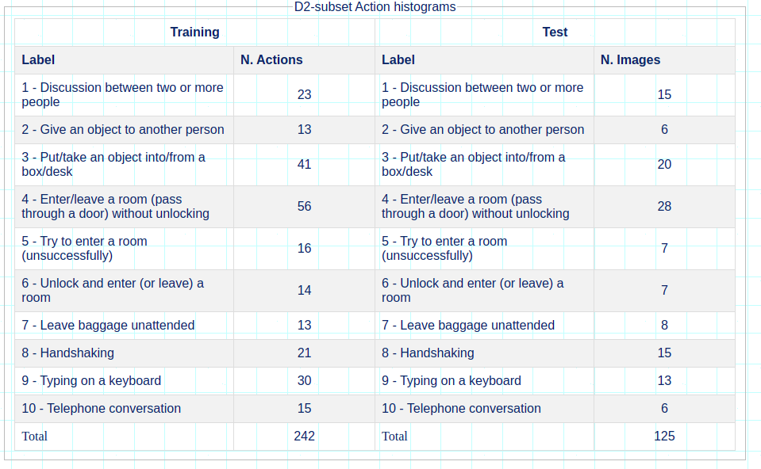
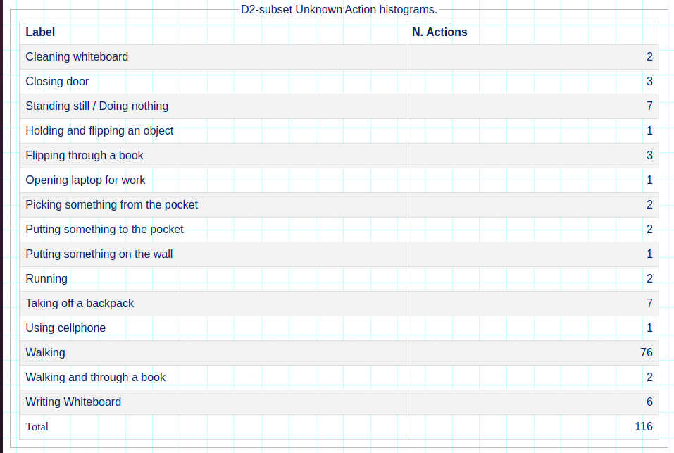

# OSVidCAP: a Framework for the Simultaneous Recognition and Description of Concurrent Actions in Videos in an Open-Set Scenario


## Introduction

Automatically understanding and describing the visual content of videos in natural language is a challenging task. Most current approaches are designed to describe single events in a closed-set setting. However, in real-world scenarios, concurrent activities and previously unseen actions may appear ina video.
The OSVidCap is a novel open-set video captioning framework that recognizes and describes, in natural language, concurrent known actions and detects the unknown ones. It is based on the encoder-decoder framework and uses a detection-and-tracking-object-based mechanism followed by a background blurring method to focus on specific targets in a video. Additionally, the TI3D Network with the Extreme Value Machine (EVM) is also used to learn representations and recognize unknown actions.


## Datasets

In our experiments, we used the benchmark ActivityNet Captions dataset and an enhanced version of the LIRIS human activity dataset.

### LIRIS human activity dataset

The LIRIS dataset was designed for recognizing complex and realistic actions in videos and made availablefor the ICPR-HARL 2012 competition. The full dataset contains 828 actions (including discussing, telephone calls, givingan item, etc.) performed by 21 different people in 10 differentclasses. It was organized into two independent subsets: the D1 subset, with depth and grayscale images, and the D2 subset, with color images. The dataset also has unannotated actions, such as walking, running, whiteboard writing,book leafing, etc. 

In this study, we used the D2 subset as known actions which contains 367 annotated actions from 167 videos. Each action consists of one or more people performing one or more different activities. 

Besides, 116 video segments in 15 different unannotated actions were extracted from the original videos. They were considered as unknown activities. Each new video segment was also annotated with spatial, temporal, and description information.

Videos are available on the Liris human activity [website](https://projet.liris.cnrs.fr/voir/activities-dataset/download.html) 





Details of using the enhanced dataset are available in the [liris_osvidcap](https://github.com/bioinfolabic/OSVidCap/tree/main/liris_osvidcap_osvidcap) folder.

### ActivityNet Captions dataset

ActivityNet Captions is a large dataset proposed for dense-captioning events, which involves both detecting and describing events in a video. It contains 20,000 videos split into around 50%, 25%, 25% for training, validation, and testing set, respectively. Although the ActivityNet Captions dataset is available for
download as a collection of Youtube video links, many of these videos are no longer available for download.

Thus, we used 12,714 videos that were still available for download. Videos shorter than 3 seconds were disregarded due to the small number of extracted frames. As our approach focused on describing entire videos and not detecting a series of events, we used the ground-truth event proposals to extract 34,934 video clips for each temporarily localized description provided in the annotations.

Details on how to download and pre-process the videos used in this study are available in the [activitynet_captions_dataset](https://github.com/bioinfolabic/OSVidCap/tree/main/activitynet_captions_osvidcap) folder.


## Related Papers

If you use of these datasets, please cite the following reference in any publications:

A. De Souza Inácio, M. Gutoski, A. E. Lazzaretti and H. S. Lopes, "OSVidCap: A Framework for the Simultaneous Recognition and Description of Concurrent Actions in Videos in an Open-Set Scenario," in IEEE Access, vol. 9, pp. 137029-137041, 2021, doi: 10.1109/ACCESS.2021.3116882.


```
@ARTICLE{9552885,
  author={De Souza Inácio, Andrei and Gutoski, Matheus and Lazzaretti, André Eugênio and Lopes, Heitor Silvério},
  journal={IEEE Access}, 
  title={OSVidCap: A Framework for the Simultaneous Recognition and Description of Concurrent Actions in Videos in an Open-Set Scenario}, 
  year={2021},
  volume={9},
  number={},
  pages={137029-137041},
  doi={10.1109/ACCESS.2021.3116882}}

```
* The LIRIS human activities dataset

C Wolf, J. Mille, E. Lombardi, O. Celiktutan, M. Jiu, E. Dogan, G. Eren, M. Baccouche, E. Dellandrea, C.-E. Bichot, C. Garcia, B. Sankur, Evaluation of video activity localizations integrating quality and quantity measurements, In Computer Vision and Image Understanding (127):14-30, 2014.

* The ActivityNet Captions dataset

Krishna, Ranjay et al. Dense-captioning events in videos. In: Proceedings of the IEEE international conference on computer vision. 2017. p. 706-715.


---------

For more information, please contact Andrei de Souza Inacio andrei.inacioo@gmail.com


<a rel="license" href="http://creativecommons.org/licenses/by-nc-nd/3.0/"></a><br />This work is licensed under a <a rel="license" href="http://creativecommons.org/licenses/by-nc-nd/3.0/">Creative Commons Attribution-NonCommercial-NoDerivs 3.0 Unported License</a>.
